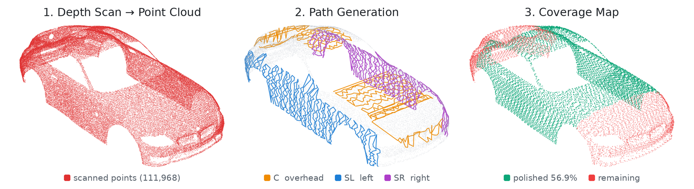

<div align="center">

# Robotic Surface Finishing Digital Twin

### Multi-Robot Car Body Polishing with 6-Axis Cobots in NVIDIA Isaac Sim
### 6축 협동로봇 기반 차체 표면 마감(폴리싱·샌딩) 디지털 트윈

차체를 3D 스캔하고, 표면 형상에 맞는 폴리싱 경로와  
**Adaptive Force Control + Multi-Robot Rail/Gantry**를 적용한 Isaac Sim 기반 디지털 트윈 프로젝트

[](https://developer.nvidia.com/isaac/sim)
[](https://docs.ros.org/en/humble/)
[](https://www.python.org/)

[](https://docs.isaacsim.omniverse.nvidia.com/)
[](https://vitejs.dev/)

</div>

---

## Overview

기존 수작업 표면 마감(폴리싱/샌딩)과 달리, 본 프로젝트는 **협동로봇이 폴리싱 패드로 차체 표면에 직접 접촉하여 마감**하도록 구성함.

숙련공의 작업을 실제 장비에 적용하기 전에 **NVIDIA Isaac Sim 디지털 트윈에서 먼저 재현·검증**하는 것이 목표.  
자동차 차체(본네트·루프·측면)를 예시 대상으로 사용하며, 스캔 대상과 작업 종류는 교체 가능함.  
시뮬레이션의 6축 협동로봇 모델로는 **Doosan M0609**를 사용함.

차체는 윗면·측면·앞뒤 범퍼처럼 곡률과 접근 방향이 서로 달라 로봇 1대, 고정 경로 하나로는 전체를 커버하기 어려움.  
이를 해결하기 위해 **3D 스캔 → 영역별 경로 생성 → 다중 로봇(천장 C + 좌측 SL + 우측 SR) 폴리싱 → 웹 대시보드 시각화** 파이프라인으로 구성함.

---

## Demo

<div align="center">
  
  <br>
  <sub>Isaac Sim 작업 셀 — 천장 갠트리(C) + 좌/우 측면 리프트(SL/SR) 로봇과 폴리싱 경로</sub>
</div>

---

## Key Contributions

1. **Scan-to-Path Pipeline**  
   가상 깊이 카메라로 차체를 스캔해 Point Cloud(`.ply`)를 만들고, 지그재그(Raster) 경로 + KDTree 법선 추정으로 폴리싱 경로(`path.npy`) 자동 생성.

2. **Multi-Robot Coverage (C / SL / SR)**  
   천장 갠트리(C)는 윗면과 앞/뒤 범퍼, 텔레스코픽 리프트 위 측면 로봇(SL/SR)은 좌/우 측면 담당. 레일 정지 위치와 작업 반경은 `rail_config.json`으로 자동 계산.

3. **Adaptive Contact Force Control**  
   실측 위치 기반 **가상 스프링 + 어드미턴스 제어**로 접촉력 유지. 표면 기울기와 작업면(윗면/측면)에 따라 목표 접촉력을 3.5 ~ 8 N 범위에서 가변.

4. **Coverage-Driven Re-Polishing**  
   커버리지 맵에서 미처리(빨간 점) 영역만 다시 추출해 다음 패스 경로를 재생성하고, 가장 가까운 미완료 구간부터 재폴리싱.

5. **ROS2 Live Dashboard & Launcher**  
   진행률·로봇별 접촉력·제거량 히트맵을 ROS2 토픽으로 발행하고, rosbridge를 통해 웹 UI에서 실시간 시각화. UI 버튼으로 스캔·시뮬레이션 실행.

---

## System

```text
┌──────────────┐     ┌────────────────────┐     ┌──────────────────────┐
│   scan.py    │     │ path_generator.py  │     │   polishing_v5.py    │
│  (깊이 스캔)  │ ──▶ │   (3D 경로 생성)    │ ──▶ │ (다중 로봇 폴리싱)     │
└──────────────┘     └────────────────────┘     └──────────────────────┘
       │                      │                            │
       ▼                      ▼                            ▼
 scan_result/{obj}/     scan_result/{obj}/          Isaac Sim 물리 시뮬레이션
 points/*.ply           path_*.npy                  (RMPFlow + 가상 스프링 접촉력)
                        rail_config.json                   │
                                                           ▼
                                             ROS2 publish ─▶ web_dashboard
                                             (실시간 힘 / 진행률 / 커버리지)
```

<div align="center">

| Phase | Description |
|---|---|
| **1. Scan** | Isaac Sim 가상 깊이 카메라(`omni.replicator`)로 차체를 다방향 촬영, 깊이 → 3D 역투영으로 Point Cloud 생성 |
| **2. Path Generation** | Raster 경로 생성, 작업 반경(0.35 ~ 0.85 m)·표면 기울기 필터, 로봇별 영역 분할 및 레일 정지점 계산 |
| **3. Car Entry & Lift** | 반도넛형 진입 스캐너 통과 후 리프트로 차량을 작업 높이까지 상승 |
| **4. Polishing** | RMPFlow로 경로 추종, 가상 스프링 접촉력 제어 + 패드 회전(3000 RPM) |
| **5. Re-Polishing** | 커버리지 맵의 미처리 영역을 재추출해 추가 패스 수행 |
| **6. Monitoring** | ROS2 → rosbridge → 웹 대시보드에서 진행률·접촉력·히트맵 실시간 표시 |

</div>

---

## Multi-Robot Layout

<div align="center">

| Robot | Mount | Target Area | Implementation |
|:---:|:---:|:---:|:---|
| **C**<br>천장 | Overhead gantry | 본네트 · 루프 · 트렁크<br>+ 앞/뒤 범퍼 | Y 레일 이동 + Z 높이 추종, 범퍼 바깥까지 정지점 확장 |
| **SL**<br>좌측 | Telescopic lift<br>+ side rail | 좌측 도어 · 펜더 | Y-Z 래스터, 리프트 높이로 수직면 추종 |
| **SR**<br>우측 | Telescopic lift<br>+ side rail | 우측 도어 · 펜더 | SL과 대칭 구성 (`outward_sign` 반전) |

</div>

### C (Overhead)
- 천장 갠트리에 장착된 협동로봇이 윗면 평탄부를 담당
- 차량 길이에 맞춰 Y 정지 위치를 등간격으로 자동 계산
- 법선 기울기 ≥ 50° 인 앞/뒤 수직면까지 도달하도록 레일 여유 구간 확장

### SL / SR (Side)
- Vention 텔레스코픽 리프트(접힘 830 mm / 펼침 1700 mm) 위에 로봇 장착
- 측면은 Y로 행을 나누고 각 행에서 Z를 따라 지그재그
- 수직·곡면·중력 영향을 고려해 윗면보다 낮은 목표 접촉력 적용

---

## Control Architecture

```text
Web UI [시작] ──HTTP──> dashboard_launcher.py ──> isaac_python polishing_v5.py
                                                          │
                                                          ▼
                                                  runner.main (Scene / Loop)
                                                          │
                              ┌───────────────────────────┼───────────────────────────┐
                              ▼                           ▼                           ▼
                     RailRobotAgent (C)         RailRobotAgent (SL)         RailRobotAgent (SR)
                              │                           │                           │
                              └────────────┬──────────────┴──────────────┬────────────┘
                                           ▼                             ▼
                                  RMPFlowController              Virtual Spring Force
                                  (EE pose tracking)            (Admittance Control)
                                           │                             │
                                           └──────────────┬──────────────┘
                                                          ▼
                                             6-Axis Cobot + Polishing Pad
                                                          │
                                                          ▼
                                    ros_publisher ──> /polishing/* ──> rosbridge ──> Web UI
```

- **runner** — 씬 구성, 차량 진입·리프트 애니메이션, 메인 루프
- **RailRobotAgent** — 로봇별 레일 이동, 경로 추종, 접촉 판정, 재폴리싱 패스 관리
- **RMPFlowController** — End-Effector를 표면 법선 방향 자세로 경로 추종
- **Virtual Spring Force** — 패드 압입량 기반 접촉력 계산 및 어드미턴스 제어
- **ros_publisher** — 상태·진행률·접촉력·히트맵 토픽 발행

### Contact Force Control

```text
F_err  = F_target(tilt, mode) − F_measured
accel  = (F_err − D · v) / M            # Admittance: D = 50, M = 1.0
v_cmd  = clip(v + accel · dt, ±0.02 m/s)
cmd    = target + lag_feedforward         # RMPFlow 정상상태 추종 지연 보정
```

<div align="center">

| Surface | Flat | Steep (tilt ≥ 45°) |
|---|:---:|:---:|
| Top (C) | 8.0 N | 5.0 N |
| Side (SL / SR) | 6.0 N | 3.5 N |

</div>

- 패드 회전: USD `RevoluteJoint`(`pad_joint`)를 314 rad/s(3000 RPM)로 속도 구동
- 과압 보호: 100 N 초과 시 후퇴, 접촉 불량 구간은 일정 스텝 후 스킵

---

## Surface Scan & Coverage

<div align="center">
  
  <br>
  <sub>깊이 스캔 Point Cloud (높이별 색상) → 로봇별 폴리싱 경로 (C / SL / SR) → 폴리싱 커버리지 맵</sub>
</div>

---

## Web Dashboard

<div align="center">
  
  <br>
  <sub>Polishing before / in-progress / done monitoring.</sub>
</div>
<br>

<div align="center">

| Phase | Panels |
|---|---|
| **폴리싱 전** | 오브젝트 & 파라미터, 스캔 결과(Point Cloud), 경로 정보 |
| **폴리싱 중** | 진행률, 카메라, 로봇별 접촉력(Force) 차트, 제거량 히트맵 |
| **폴리싱 완료** | 3D 커버리지(360° 회전), 전/후 비교, 결과 지표, 분석 레포트 |

| Topic | Type | Description |
|---|---|---|
| `/polishing/state` | `std_msgs/String` | `POLISH` / `DONE` |
| `/polishing/progress` | `std_msgs/Float64` | 전체 진행률 (%) |
| `/polishing/progress/{C,SL,SR}` | `std_msgs/Float64` | 로봇별 진행률 (%) |
| `/polishing/force/{C,SL,SR}` | `std_msgs/Float64` | 로봇별 접촉력 (N) |
| `/polishing/elapsed_time` | `std_msgs/Float64` | 경과 시간 (s) |
| `/polishing/heatmap` | `std_msgs/Float64MultiArray` | 탑뷰 제거 커버리지 |

</div>

---

## Engineering Challenges

<div align="center">

| Problem | Solution |
|---|---|
| 패드·차체 강체 충돌 시 접촉 순간 튕김(Slam) 발생 | 팔/샌더 충돌 비활성화, 실측 위치 기반 **가상 스프링**으로 접촉력 계산 |
| RMPFlow가 명령보다 덜 내려오는 정상상태 지연(~2 cm) | **Lag Feedforward**로 지연량을 추정해 명령을 더 깊게 보정 |
| 차체를 RMPFlow 장애물로 넣으면 패드까지 밀어냄 | 차체 장애물 비활성화 + 링크 단위 **Arm Guard**로 관통 감지 및 복구 |
| 로봇 특이점·도달 한계로 경로 추종 실패 | 작업 반경 0.35 ~ 0.85 m 필터 + 레일 정지점 분할 |
| 측면에서 패드가 표면 위 5 ~ 7 mm 부유 | 측면 가상 접촉 거리 0.015 → 0.010 m로 조정해 평형점을 표면에 맞춤 |
| 유리·급경사면까지 경로가 생성됨 | 표면 기울기 15° 초과 영역 제외 (윗면 평탄부만) |
| 1회 패스 후 미처리 영역 잔존 | 커버리지 맵 기반 **재폴리싱 패스** 자동 생성 |

</div>

---

## Environment

<div align="center">

| Category | Specification |
|---|---|
| OS | Ubuntu 22.04.5 LTS |
| Simulator | NVIDIA Isaac Sim (standalone `python.sh`) |
| Middleware | ROS2 Humble + rosbridge_suite |
| Robot | 6축 협동로봇 (시뮬레이션 모델: Doosan M0609, URDF / USD) |
| End-Effector | Sander + Polishing Pad (`m0609_with_polisher.usd`) |
| Lift / Rail | Vention 518823 Telescopic Lift, Linear Rail |
| Language | Python 3.10 |
| Motion | RMPFlow (`rmpflow/`) |
| Contact Control | Virtual Spring + Admittance Control |
| Dashboard | Node.js 20 + Vite 8 + Chart.js 4 |
| GPU | NVIDIA GeForce RTX 5080 Laptop (RTX 계열 권장) |

</div>

> **Isaac Sim 실행기 alias** (개발 환경 기준)
> ```bash
> alias isaac_python='~/isaacsim/python.sh'
> ```
> Isaac Sim 스크립트(`scan.py`, `polishing_v*.py`)는 반드시 `isaac_python`으로 실행 (시스템 `python3` 불가).

---

## Installation

```bash
git clone https://github.com/seb000423/robotic-surface-finishing-digital-twin.git
cd robotic-surface-finishing-digital-twin

# Python 의존성 (numpy, scipy, matplotlib, Pillow, gmsh)
pip install -r requirements.txt

# ROS2 ↔ Web UI 브릿지
sudo apt install ros-humble-rosbridge-suite

# Web Dashboard
cd web_dashboard && npm install
```

- `isaacsim`, `omni.*`, `carb`, `pxr` — Isaac Sim 내장 (pip 설치 X)
- `rclpy`, `std_msgs`, `sensor_msgs` — ROS2 Humble 제공 (pip 설치 X)

---

## Usage

### 1. Web Dashboard로 실행 (권장)

```bash
# Isaac Sim 경로가 다르면 지정
export ISAAC_PYTHON=/path/to/isaacsim/python.sh

./run_dashboard.sh
```

Open:

```text
http://localhost:5173
```

- **[시작]** → 런처(:8765)가 `isaac_python polishing_v5.py` 실행
- **[스캔]** → `scan.py` → `path_generator.py` 순차 실행
- `run_dashboard.sh`가 rosbridge(:9090)도 함께 실행. rosbridge가 없으면 UI는 **데모 모드**로 동작

### 2. 전체 파이프라인 한 번에

```bash
python3 scripts/main_pipeline.py car      # 또는 cube
```

### 3. 단계별 실행

```bash
# ① 깊이 스캔
isaac_python scripts/scan.py --obj_name car

# ② 3D 경로 생성
python3 scripts/path_generator.py --obj_name car

# ③ 폴리싱 시뮬레이션
isaac_python scripts/polishing_v1.py --obj_name car      # 단일 로봇
isaac_python scripts/polishing_v5.py --obj_name car      # 다중 로봇 (C + SL + SR)
isaac_python scripts/polishing_v5.py --obj_name car --headless
```

### 4. Web UI만 실행 (시뮬레이션 없이)

```bash
cd web_dashboard
npm run dev                          # http://localhost:5173
npm run build && npm run preview     # 빌드 후 미리보기
```

### ROS2 Topic Example

```bash
ros2 topic echo /polishing/state
ros2 topic echo /polishing/progress
ros2 topic echo /polishing/force/C
```

> 수동 실행 시 터미널 2개: `python3 scripts/dashboard_launcher.py` / `cd web_dashboard && npm run dev`

---

## Repository Structure

```text
robotic-surface-finishing-digital-twin/
├── scripts/
│   ├── scan.py                  # ① 깊이 스캔 → Point Cloud
│   ├── path_generator.py        # ② 경로 생성 + rail_config.json
│   ├── polishing_v1.py          # ③ 단일 로봇 폴리싱
│   ├── polishing_v4.py          #    4대 로봇 모드
│   ├── polishing_v5.py          #    다중 로봇 진입점 (UI 시작 버튼)
│   ├── polishing_v5_modules/
│   │   ├── bootstrap.py         #   CLI · SimulationApp 초기화
│   │   ├── runner.py            #   씬 구성 · 메인 루프
│   │   ├── agent.py             #   로봇별 제어 (RailRobotAgent)
│   │   ├── common.py            #   상수 · 힘 제어 파라미터
│   │   ├── ros_publisher.py     #   ROS2 토픽 발행
│   │   └── visualization.py     #   커버리지 맵 · 경로 시각화
│   ├── main_pipeline.py         # 스캔 → 경로 → 폴리싱 일괄 실행
│   └── dashboard_launcher.py    # UI 버튼 → Isaac Sim 실행 (:8765)
│
├── rmpflow/                     # RMPFlow 컨트롤러 · yaml · URDF
├── scan_obj/                    # 스캔 대상 USD (car, car_small, cube)
├── scan_result/                 # 스캔 · 경로 결과 (PLY, npy, rail_config.json)
├── usd/env/                     # 로봇 · 리프트 · 레일 · 공간 USD 에셋
├── web_dashboard/               # Vite + Chart.js 대시보드
│   ├── src/                     #   main.js, ros-bridge.js, force-chart.js, coverage3d.js
│   └── public/                  #   이미지 · 데이터
│
├── assets/                      # README 이미지
├── requirements.txt
├── run_dashboard.sh             # rosbridge + 런처 + UI 통합 실행
└── README.md
```

---

<div align="center">

**NVIDIA Isaac Sim × ROS2 × 6-Axis Cobot**

Digital twin for skilled surface finishing with collaborative robots.

</div>
